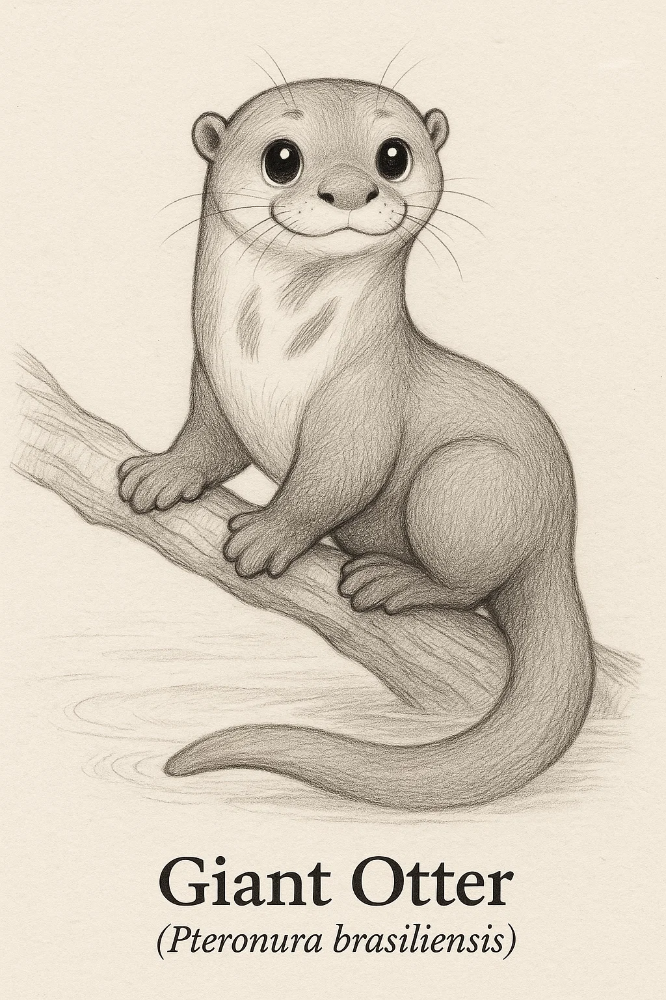
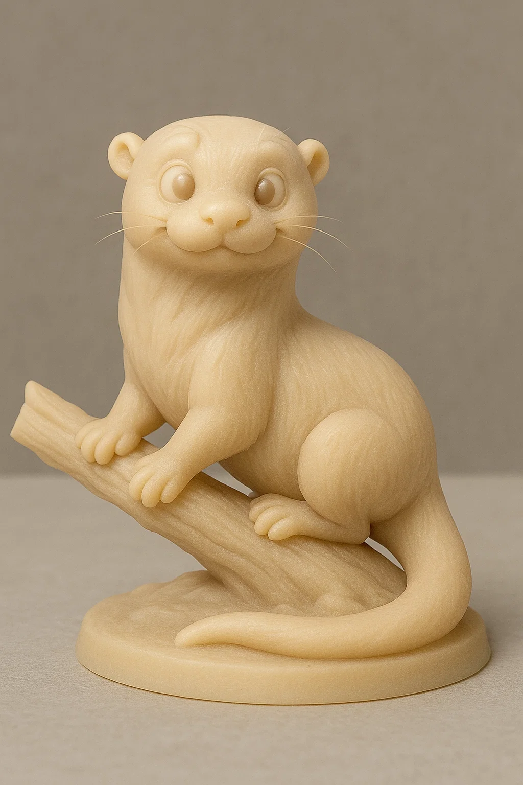
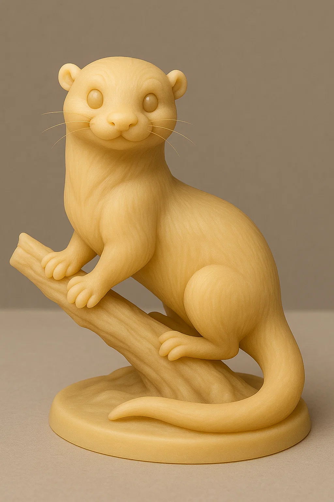

# Ariranha

## Espécie
**Nome Comum:** Ariranha  
**Nome Científico:** *Pteronura brasiliensis*

### Resumo sobre o animal
A ariranha é a maior espécie de mustelídeo do mundo. Vive em rios e igarapés da América do Sul, especialmente na Amazônia. É sociável, vocal e excelente nadadora, formando grupos familiares cooperativos e comunicando-se com uma variedade de sons impressionante.

---

## Ilustrações

### Referências visuais
> Coletadas na internet, algumas em baixa resolução. Foi montado um painel no PureRef com um subconjunto de cada espécie.

### Rascunho
> Esboço inicial do personagem, feito em estilo tradicional ou digital com traço solto, produzido a partir de várias iterações com sistema de IA Generativa (Chat GPT e Sora), com ajustes manuais, a partir de imagens de referências coletadas na internet.

### Paleta de cores

### Ilustração Digital
> Versão renderizada no Krita com estilo definido da coleção.

EM BREVE!

---

## Miniatura de Resina 3D (Concept IA)
> Concept art para futura modelagem e impressão em resina. Estilo de miniatura de RPG, monocromática, com base.

---

## Ilustração para Livro de Colorir (Lineart)
> Versão lineart do personagem, em preto e branco, com traços suaves e contornos claros.

---

## Ficha Colecionável

### Nome do Personagem
**Ariranha**

### Espécie
**Ariranha** (*Pteronura brasiliensis*)

### Personalidade
Extrovertida, protetora e sempre com um comentário na ponta da língua (ou um assobio). Adora brincar em grupo e proteger seus irmãos mais novos.

### Habilidade Especial
Mestre da natação sincronizada. Quando está com sua família, forma verdadeiras patrulhas aquáticas de fofura coordenada.

### Curiosidade
Cada ariranha tem uma mancha única no pescoço, que funciona como uma "impressão digital" para identificação. Seus grupos emitem vocalizações distintas e têm laços familiares muito fortes.

### Raridade
**Em Perigo**  
_(Categoria da IUCN: Endangered – ameaçada por perda de habitat e poluição hídrica)_

---

## Notas Técnicas

- **Expressão canônica:** Brincalhona e confiante, com a boca entreaberta e corpo em leve curva de nado.
- **Anatomia:** Corpo longo e forte, cauda achatada em formato de remo, membros robustos com membranas interdigitais.
- **Olhos:** Pretos ovais com brilho especular.
- **Pelagem:** Castanho escura com mancha clara no pescoço e queixo.
- **Rascunho referência:** silhueta de nado ou de alerta na margem do rio, focinho arredondado e vibrissas marcadas.

---

**Referência:**  
Informações científicas adaptadas de: [genuinemustelids.org/family/otters/](https://www.genuinemustelids.org/family/otters/)
