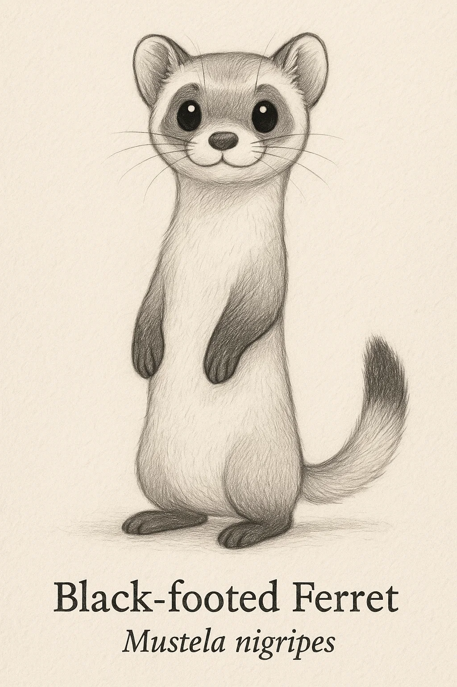
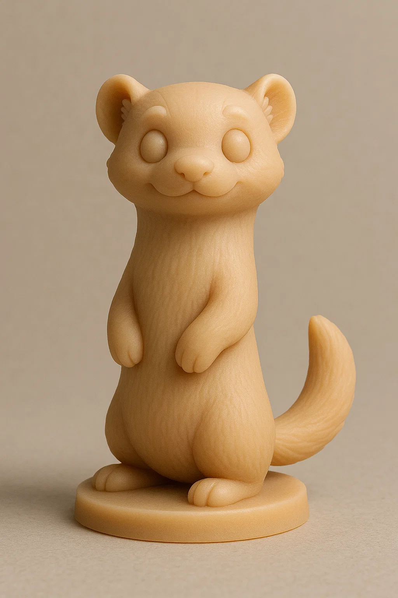
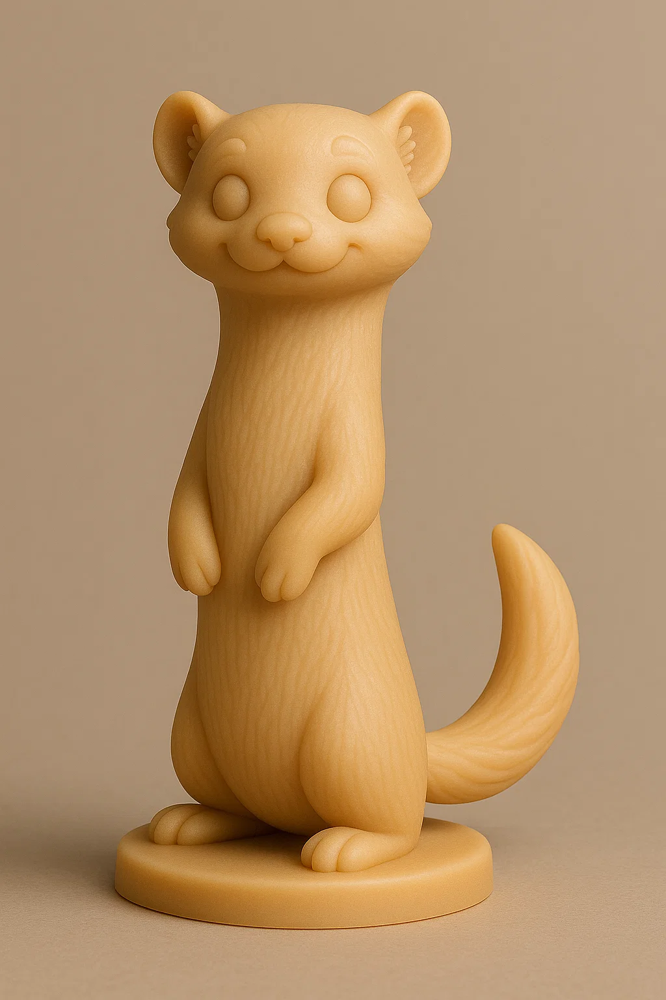

# Furão-de-pés-pretos

## Espécie
**Nome Comum:** Furão-de-pés-pretos  
**Nome Científico:** *Mustela nigripes*

### Resumo sobre o animal
O furão-de-pés-pretos é um dos mustelídeos mais raros da América do Norte. Por muito tempo foi considerado extinto na natureza, mas esforços de conservação permitiram sua reintrodução em áreas protegidas. Tem hábitos noturnos e se alimenta principalmente de cães-da-pradaria, vivendo em seus sistemas de tocas.

---

## Ilustrações

### Referências visuais
> Coletadas na internet, algumas em baixa resolução. Foi montado um painel no PureRef com um subconjunto de cada espécie.

### Rascunho
> Esboço inicial do personagem, feito em estilo tradicional ou digital com traço solto, produzido a partir de várias iterações com sistema de IA Generativa (Chat GPT e Sora), com ajustes manuais, a partir de imagens de referências coletadas na internet.

### Paleta de cores

### Ilustração Digital
> Versão renderizada no Krita com estilo definido da coleção.

EM BREVE!

---

## Miniatura de Resina 3D (Concept IA)
> Concept art para futura modelagem e impressão em resina. Estilo de miniatura de RPG, monocromática, com base.

---

## Ilustração para Livro de Colorir (Lineart)
> Versão lineart do personagem, em preto e branco, com traços suaves e contornos claros.

---

## Ficha Colecionável

### Nome do Personagem
**Furão-de-pés-pretos**

### Espécie
**Furão-de-pés-pretos** (*Mustela nigripes*)

### Personalidade
Observador e estrategista, com espírito resiliente. Tímido à primeira vista, mas extremamente dedicado aos seus objetivos.

### Habilidade Especial
Pode desaparecer em tocas com incrível agilidade. Mestre em navegação subterrânea e espionagem discreta.

### Curiosidade
Foi considerado extinto até 1981, quando uma pequena população foi redescoberta nos Estados Unidos. Desde então, tornou-se um símbolo dos programas de conservação bem-sucedidos.

### Raridade
**Em Perigo Crítico**  
_(Categoria da IUCN: Critically Endangered – espécies com risco extremamente alto de extinção na natureza)_

---

## Notas Técnicas

- **Expressão canônica:** Atenta e curiosa, com olhar concentrado e corpo em leve inclinação para frente.
- **Anatomia:** Corpo esguio, patas curtas, pelagem clara com manchas escuras nas pernas e máscara facial.
- **Olhos:** Pretos ovais e vibrantes, levemente projetados.
- **Pelagem:** Creme-claro com pernas e extremidades pretas; máscara escura nos olhos.
- **Rascunho referência:** postura de alerta, corpo arqueado e patas unidas, focinho fino.

---

**Referência:**  
Informações científicas adaptadas de: [genuinemustelids.org/family/weasels/polecats/#4-north-american-polecat-mustela-nigripes](https://www.genuinemustelids.org/family/weasels/polecats/#4-north-american-polecat-mustela-nigripes)
