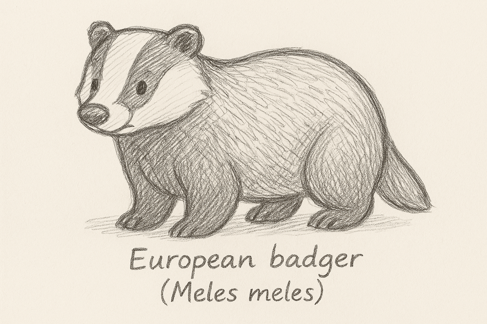
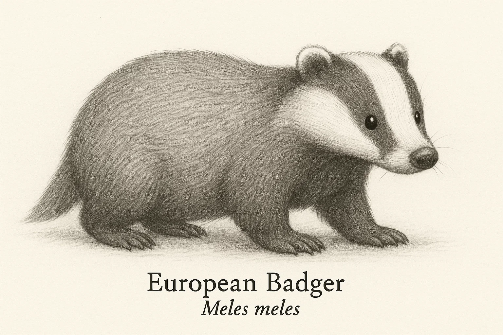
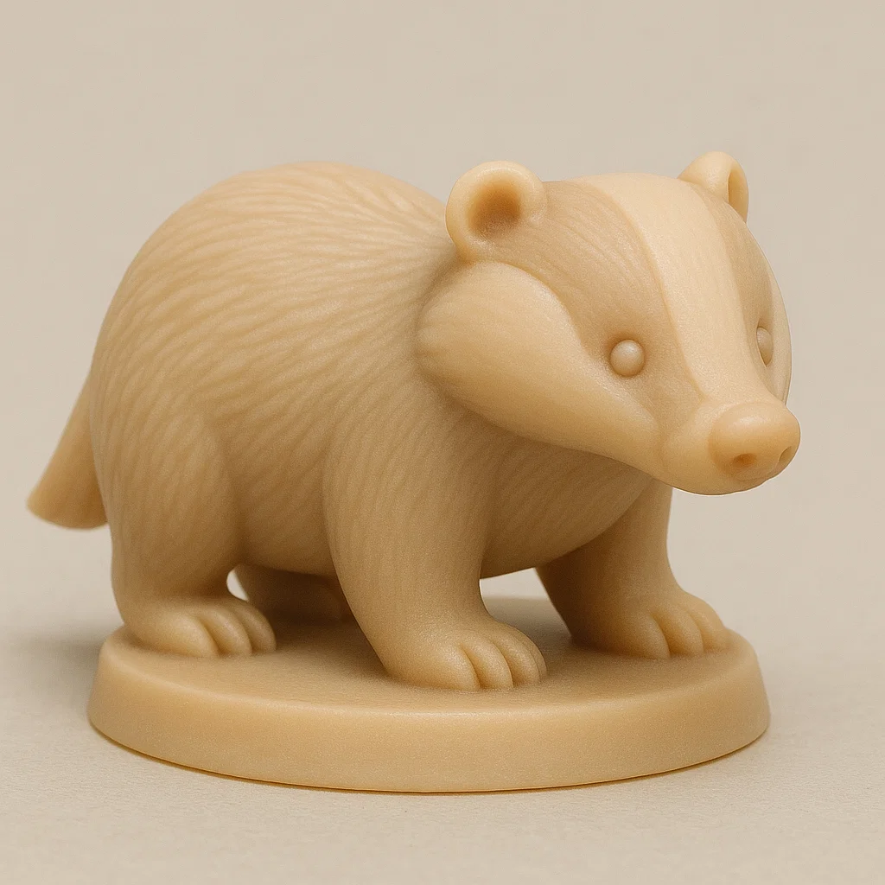

# Texugo Europeu

## Espécie
**Nome Comum:** Texugo-europeu  
**Nome Científico:** *Meles meles*

### Resumo sobre o animal
O texugo-europeu é um mustelídeo robusto e social que vive em tocas complexas chamadas “setts”. Costuma habitar florestas, campos e áreas rurais da Europa. É noturno, cavador habilidoso e forma grupos familiares com hierarquias bem definidas.

---

## Ilustrações

### Referências visuais
> Coletadas na internet, algumas em baixa resolução. Foi montado um painel no PureRef com um subconjunto de cada espécie.

### Rascunho
> Esboço inicial do personagem, feito em estilo tradicional ou digital com traço solto, produzido a partir de várias iterações com sistema de IA Generativa (Chat GPT e Sora), com ajustes manuais, a partir de imagens de referências coletadas na internet.

### Paleta de cores

### Ilustração Digital
> Versão renderizada no Krita com estilo definido da coleção.

EM BREVE!

---

## Miniatura de Resina 3D (Concept IA)
> Concept art para futura modelagem e impressão em resina. Estilo de miniatura de RPG, monocromática, com base.

---

## Ilustração para Livro de Colorir (Lineart)
> Versão lineart do personagem, em preto e branco, com traços suaves e contornos claros.

---

## Ficha Colecionável

### Nome do Personagem
**Texugo-europeu**

### Espécie
**Texugo-europeu** (*Meles meles*)

### Personalidade
Calmo, protetor e metódico. Gosta de rotina e prefere atividades noturnas, especialmente aquelas que envolvem escavar e reorganizar a toca.

### Habilidade Especial
Mestre da engenharia subterrânea. Consegue transformar qualquer espaço em uma toca confortável e surpreendentemente organizada.

### Curiosidade
Os texugos europeus vivem em grupos sociais e dividem suas tocas por gerações. Alguns sistemas de túneis têm décadas de uso contínuo.

### Raridade
**Pouco Preocupante**  
_(Categoria da IUCN: Least Concern – distribuição ampla na Europa e população relativamente estável)_

---

## Notas Técnicas

- **Expressão canônica:** Serena e observadora, com postura ereta e focinho levemente elevado.
- **Anatomia:** Corpo robusto e baixo, pernas curtas e fortes, cauda curta.
- **Olhos:** Pretos ovais com brilho discreto.
- **Pelagem:** Cinza claro no dorso com faixas pretas longitudinais no rosto – a clássica máscara de texugo.
- **Rascunho referência:** perfil lateral com contorno limpo, focinho pontudo e formato corpulento.

**Referência:**  
Informações científicas adaptadas de: [genuinemustelids.org/family/badgers](https://www.genuinemustelids.org/family/badgers/)
