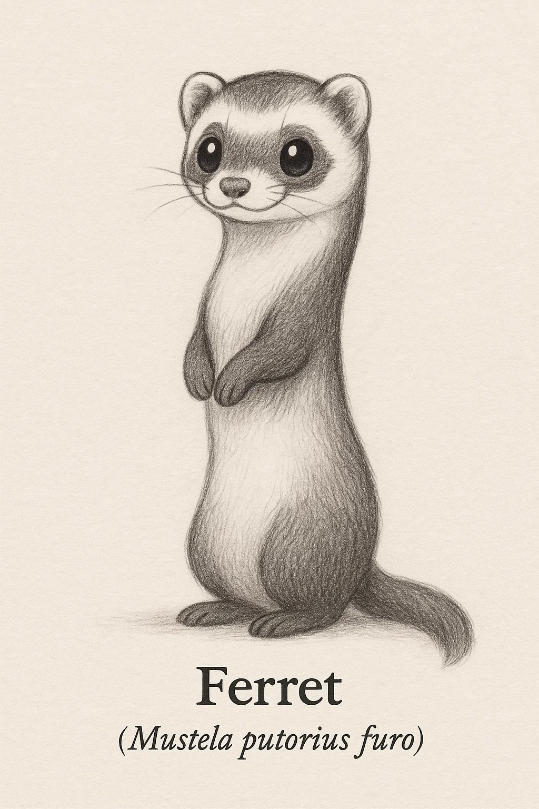
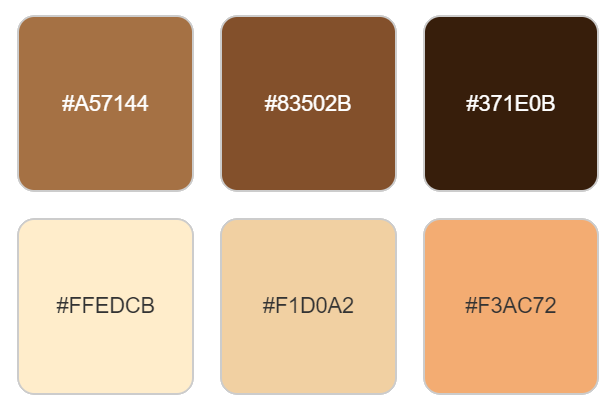
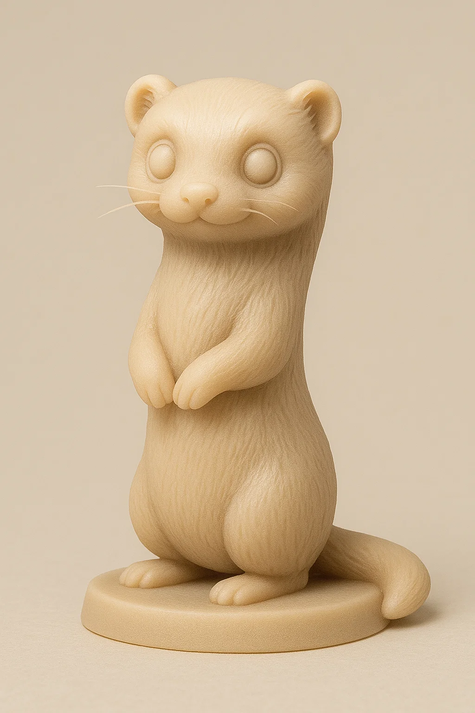
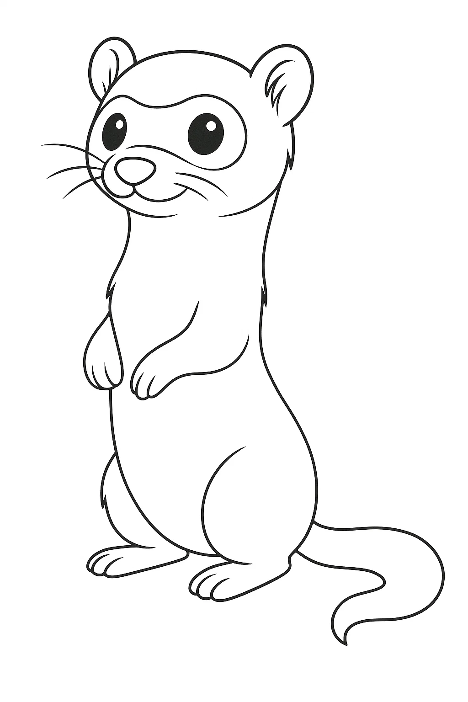
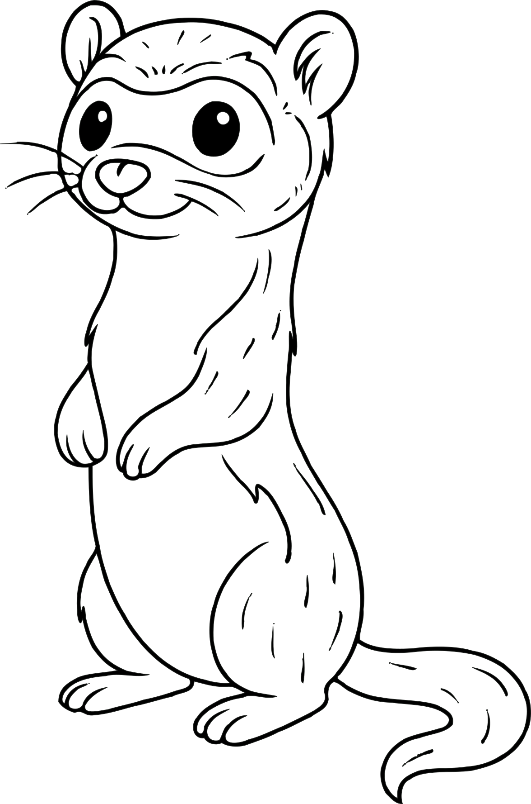

# Furão

## Espécie
**Nome Comum:** Furão (Doméstico)  
**Nome Científico:** *Mustela putorius furo*

### Resumo sobre o animal
O furão é uma subespécie domesticada do toirão europeu, criado por humanos há milhares de anos. É curioso, brincalhão e possui hábitos crepusculares. Popular como animal de estimação, mantém comportamentos instintivos como se esconder, cavar e investigar tudo à sua volta.

---

## Ilustrações

### Referências visuais
> Coletadas na internet, algumas em baixa resolução. Foi montado um painel no PureRef com um subconjunto de cada espécie.

### Rascunho
> Esboço inicial do personagem, feito em estilo tradicional ou digital com traço solto, produzido a partir de várias iterações com sistema de IA Generativa (Chat GPT e Sora), com ajustes manuais, a partir de imagens de referências coletadas na internet.

### Paleta de cores

### Ilustração Digital
> Versão renderizada no Krita com estilo definido da coleção.

EM BREVE!

---

## Miniatura de Resina 3D (Concept IA)
> Concept art para futura modelagem e impressão em resina. Estilo de miniatura de RPG, monocromática, com base.

---

## Ilustração para Livro de Colorir (Lineart)
> Versão lineart do personagem, em preto e branco, com traços suaves e contornos claros.

---

## Ficha Colecionável

### Nome do Personagem
**Furão**

### Espécie
**Furão doméstico** (*Mustela putorius furo*)

### Personalidade
Extremamente curioso, energético e sociável. Ama explorar qualquer canto novo — especialmente caixas, gavetas e bolsos esquecidos.

### Habilidade Especial
Especialista em esconder objetos e desaparecer com tampas de caneta. Tem talento nato para encontrar caminhos alternativos (e sumir por eles).

### Curiosidade
Mesmo domesticado há milênios, o furão mantém muitos comportamentos selvagens, como arrastar presas imaginárias e dormir até 18 horas por dia.

### Raridade
**Doméstico**  
_(Espécie domesticada – amplamente criada por humanos, mas não ocorre naturalmente na natureza)_

---

## Notas Técnicas

- **Expressão canônica:** Olhar atento e curioso, com boquinha levemente aberta em pose brincalhona.
- **Anatomia:** Corpo esguio e alongado, patas curtas, orelhas pequenas e cauda estreita.
- **Olhos:** Pretos ovais com brilho especular visível.
- **Pelagem:** Padrão *sable*, com máscara escura no rosto e tons marrons suaves no dorso e membros.
- **Rascunho referência:** versão com postura ereta (sentado), pelagem detalhada e traços simpáticos.

**Referência:**  
Informações científicas adaptadas de: [genuinemustelids.org/family/weasels/ferret](https://www.genuinemustelids.org/family/weasels/ferret/)

