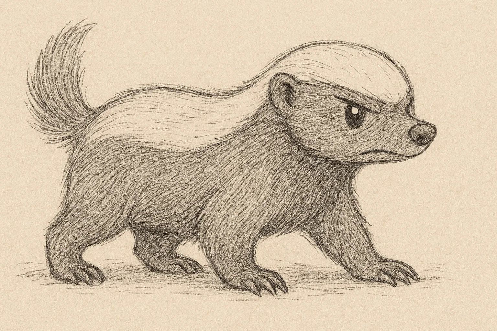
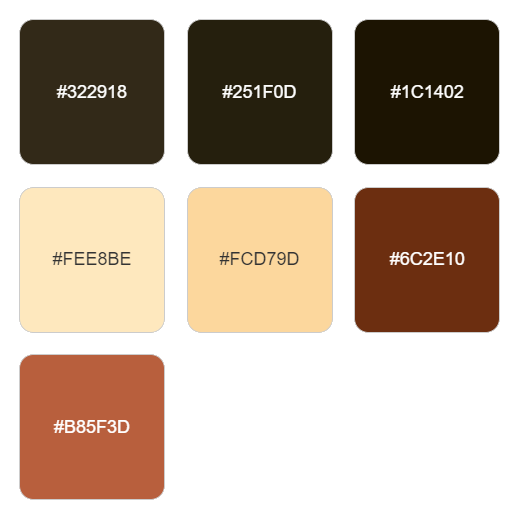
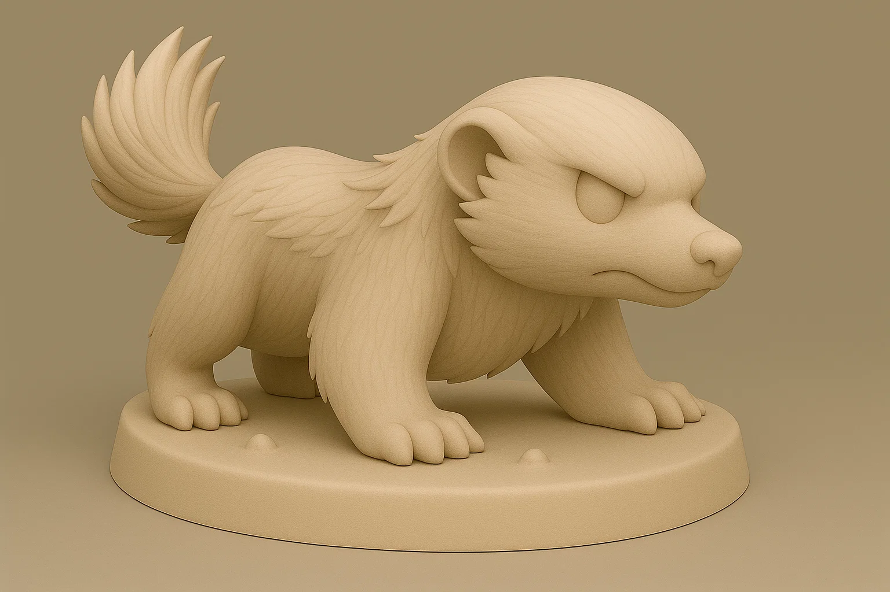
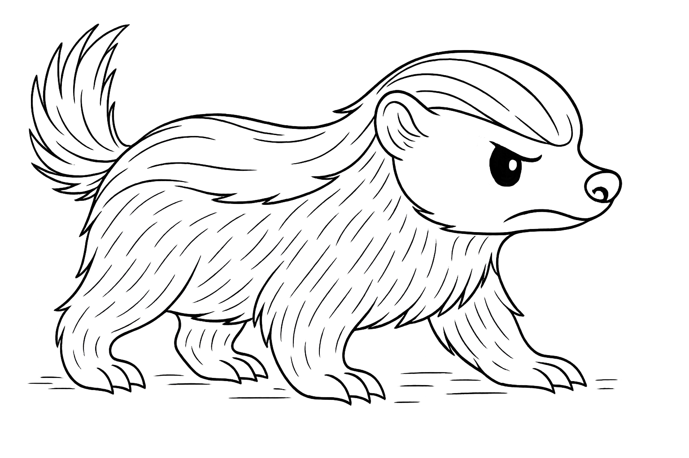

# Texugo do Mel

## Espécie
**Nome Comum:** Texugo-do-mel  
**Nome Científico:** *Mellivora capensis*

### Resumo sobre o animal

> O texugo-do-mel é conhecido por sua bravura desproporcional ao seu tamanho. Habita regiões da África e da Ásia, sendo um dos carnívoros mais ousados da natureza.

---

## Ilustrações

### Referências visuais
> Coletadas na internet, algumas em baixa resolução. Foi montado um painel no PureRef com um subconjunto de cada espécie.

### Rascunho
> Esboço inicial do personagem, feito em estilo tradicional ou digital com traço solto, produzido a partir de várias iterações com sistema de IA Generativa (Chat GPT e Sora), com ajustes manuais, a partir de imagens de referências coletadas na internet.

### Paleta de cores

### Ilustração Digital
> Versão renderizada no Krita com estilo definido da coleção.

EM BREVE!
---

## Miniatura de Resina 3D (Concept IA)
> Concept art para futura modelagem e impressão em resina. Estilo de miniatura de RPG, monocromática, com base.

---

## Ilustração para Livro de Colorir (Lineart)
> Versão lineart do personagem, em preto e branco, com traços suaves e contornos claros.

---

## Ficha Colecionável

### Nome do Personagem
**Texugo-do-mel**

### Espécie
**Texugo-do-mel** (*Mellivora capensis*)

### Personalidade
Destemido, impetuoso e dono de um coração valente. Sempre pronto para encarar qualquer situação — seja na selva ou embaixo do sofá.

### Habilidade Especial
Pode atravessar qualquer confusão (inclusive de cabos) sem se embaraçar. Adora desmontar caixas de papelão e investigar mochilas alheias.

### Curiosidade
Conhecido por desafiar predadores muito maiores — inclusive aspiradores robôs. Seu lema: “se mexe, eu encaro”.

### Raridade
**Pouco Preocupante**  
_(Categoria da IUCN: Least Concern — população estável e ampla distribuição)_

---

## Notas Técnicas

- **Expressão canônica:** Levemente brava e determinada ("cute-braveness").
- **Anatomia:** Corpo compacto, ombros largos, cauda curta e fofa.
- **Olhos:** Pretos ovais com brilho especular sutil.
- **Pelagem:** Máscara clara no dorso, com base escura nas patas e barriga.
- **Rascunho referência:** versão com boquinha curva fechada, focinho fino e garras visíveis.
