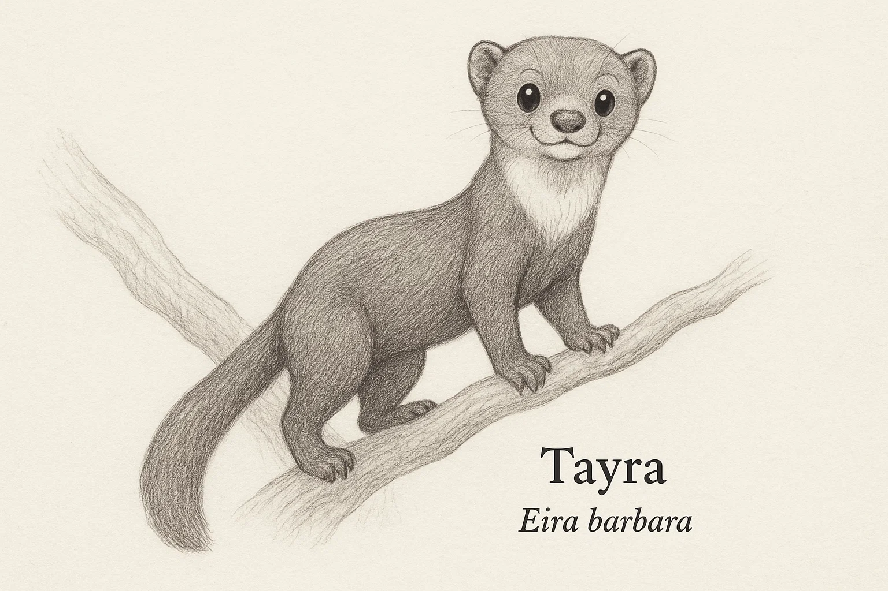
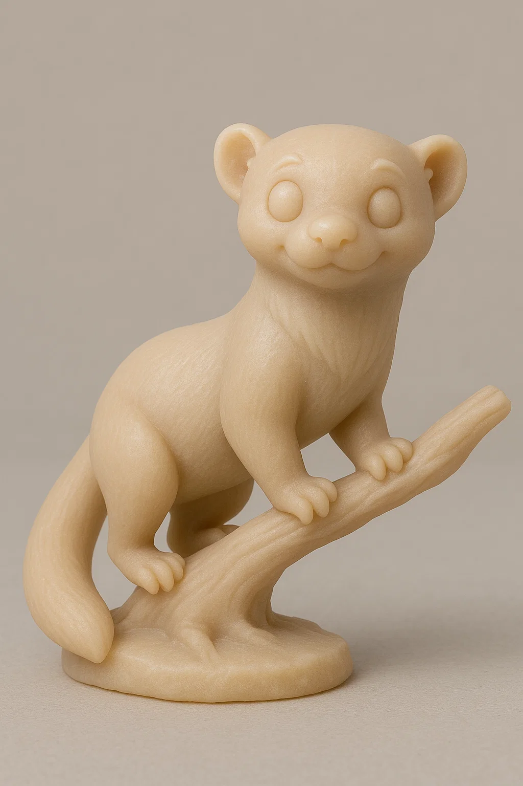
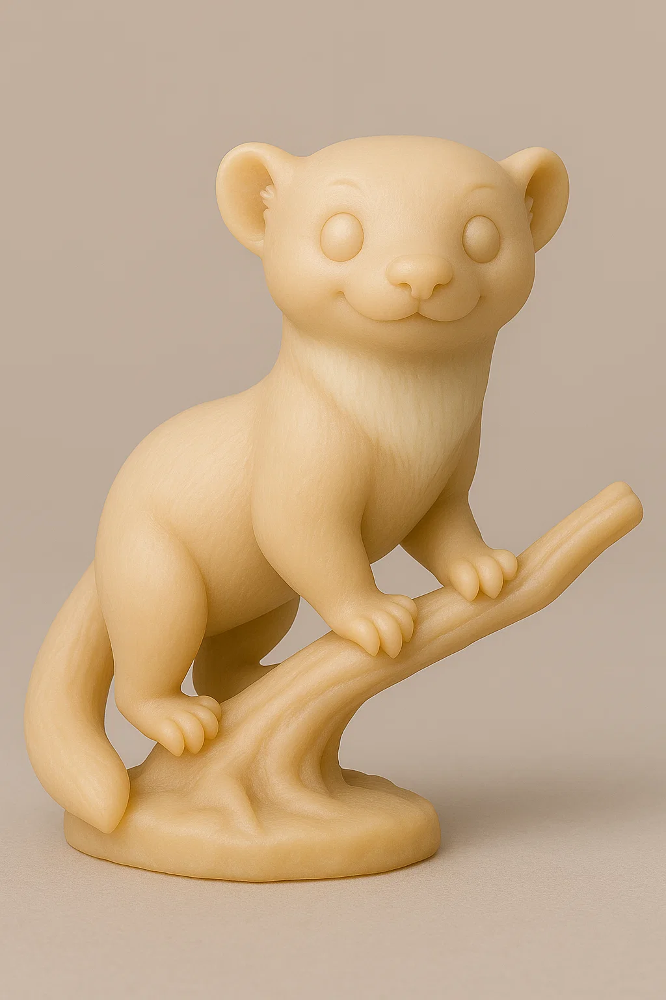

# Irara

## Espécie
**Nome Comum:** Irara (ou Tayra)  
**Nome Científico:** *Eira barbara*

### Resumo sobre o animal
A irara é um mustelídeo arborícola nativo das Américas Central e do Sul. Ágil, curiosa e com hábitos diurnos, é uma excelente escaladora e saltadora. Vive em florestas tropicais e é uma das poucas espécies da família Mustelidae com distribuição predominantemente neotropical.

---

## Ilustrações

### Referências visuais
> Coletadas na internet, algumas em baixa resolução. Foi montado um painel no PureRef com um subconjunto de cada espécie.

### Rascunho
> Esboço inicial do personagem, feito em estilo tradicional ou digital com traço solto, produzido a partir de várias iterações com sistema de IA Generativa (Chat GPT e Sora), com ajustes manuais, a partir de imagens de referências coletadas na internet.

### Paleta de cores

### Ilustração Digital
> Versão renderizada no Krita com estilo definido da coleção.

EM BREVE!

---

## Miniatura de Resina 3D (Concept IA)
> Concept art para futura modelagem e impressão em resina. Estilo de miniatura de RPG, monocromática, com base.

> Alguns mustelídeos deste projeto possuem mais de uma miniatura pois a geração com IA não conseguiu representar bem em um só exemplo.

---

## Ilustração para Livro de Colorir (Lineart)
> Versão lineart do personagem, em preto e branco, com traços suaves e contornos claros.

---

## Ficha Colecionável

### Nome do Personagem
**Irara**

### Espécie
**Irara** (*Eira barbara*)

### Personalidade
Espontânea, criativa e impossível de conter. Adora explorar alturas, empoleirar-se em prateleiras e observar o mundo de cima.

### Habilidade Especial
Consegue escalar qualquer superfície (inclusive estantes e montes de livros) e possui olfato afiado para frutas escondidas ou ideias brilhantes.

### Curiosidade
Apesar de ser carnívora, a irara consome uma grande quantidade de frutas, e inclusive espalha sementes pelas florestas. É considerada uma das mustelídeas mais “ecológicas”.

### Raridade
**Pouco Preocupante**  
_(Categoria da IUCN: Least Concern – ampla distribuição em florestas tropicais, mas afetada por desmatamento em algumas regiões)_

---

## Notas Técnicas

- **Expressão canônica:** Curiosa e alerta, com pose ativa e cauda erguida.
- **Anatomia:** Corpo esguio e ágil, patas longas, cauda longa e peluda.
- **Olhos:** Pretos ovais com brilho especular visível.
- **Pelagem:** Escura, com garganta mais clara (amarelada ou branca, variando por região).
- **Rascunho referência:** postura ereta sobre galho, focinho alongado e expressão vigilante.

---

**Referência:**  
Informações científicas adaptadas de: [genuinemustelids.org/tayra](https://www.genuinemustelids.org/tayra)
