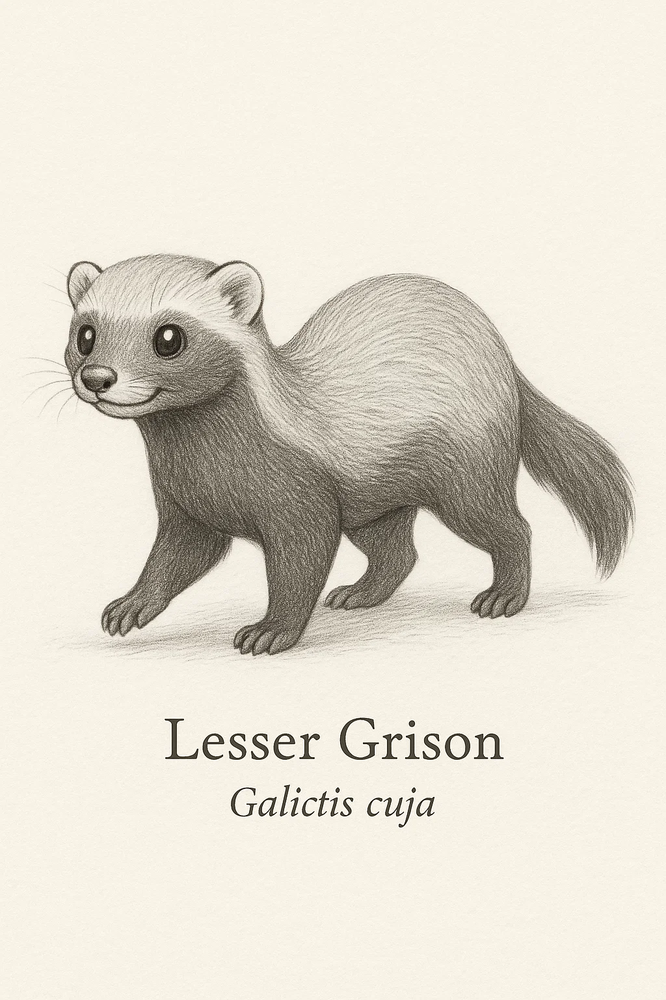
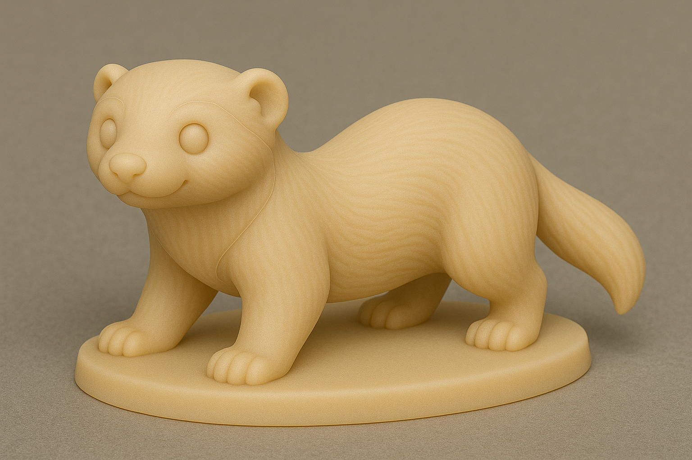
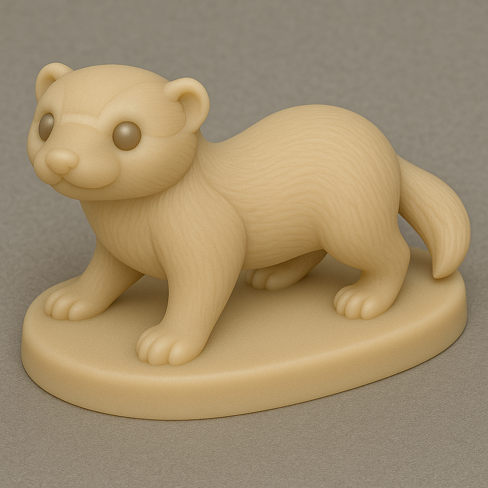

# Furão-pequeno

## Espécie
**Nome Comum:** Furão-pequeno (ou Grison)  
**Nome Científico:** *Galictis cuja*

### Resumo sobre o animal
O furão-pequeno é um mustelídeo sul-americano adaptável, ágil e de hábitos principalmente terrestres. Vive em áreas abertas e florestas ralas, e é conhecido por seu andar rasteiro e comportamento energético. Apesar do nome e aparência semelhantes, não é um parente direto do furão doméstico.

---

## Ilustrações

### Referências visuais
> Coletadas na internet, algumas em baixa resolução. Foi montado um painel no PureRef com um subconjunto de cada espécie.

### Rascunho
> Esboço inicial do personagem, feito em estilo tradicional ou digital com traço solto, produzido a partir de várias iterações com sistema de IA Generativa (Chat GPT e Sora), com ajustes manuais, a partir de imagens de referências coletadas na internet.

### Paleta de cores

### Ilustração Digital
> Versão renderizada no Krita com estilo definido da coleção.

EM BREVE!

---

## Miniatura de Resina 3D (Concept IA)
> Concept art para futura modelagem e impressão em resina. Estilo de miniatura de RPG, monocromática, com base.

---

## Ilustração para Livro de Colorir (Lineart)
> Versão lineart do personagem, em preto e branco, com traços suaves e contornos claros.

---

## Ficha Colecionável

### Nome do Personagem
**Furão-pequeno**

### Espécie
**Furão-pequeno** (*Galictis cuja*)

### Personalidade
Ágil, atento e extremamente curioso. Está sempre pronto para investigar um canto esquecido ou correr em zigue-zague sem razão aparente.

### Habilidade Especial
Pode atravessar cercas, escorregar por frestas e se mover rapidamente por baixo de móveis — mestre da travessura discreta.

### Curiosidade
Apesar da aparência fofa, é um caçador eficiente e pode emitir vocalizações intensas quando se sente ameaçado.

### Raridade
**Pouco Preocupante**  
_(Categoria da IUCN: Least Concern – espécie distribuída por boa parte da América do Sul, adaptável a ambientes variados)_

---

## Notas Técnicas

- **Expressão canônica:** Atenta e alerta, com corpo semi-abaixado em postura dinâmica.
- **Anatomia:** Corpo alongado, pescoço curto, patas curtas, cauda média.
- **Olhos:** Pretos ovais com brilho especular.
- **Pelagem:** Dorso cinza prateado, máscara escura no rosto e ventre preto.
- **Rascunho referência:** vista lateral com pose de movimentação e contraste forte entre dorso e ventre.

---

**Referência:**  
Informações científicas adaptadas de: [genuinemustelids.org/family/grisons](https://www.genuinemustelids.org/family/grisons/)
