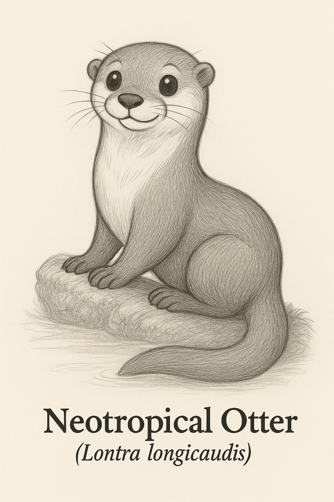
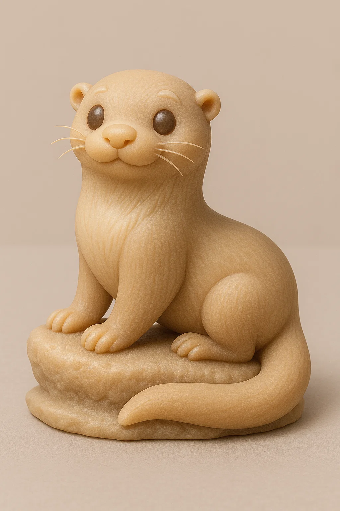

# Lontra-de-rio

## Espécie
**Nome Comum:** Lontra-de-rio (ou Lontra-neotropical)  
**Nome Científico:** *Lontra longicaudis*

### Resumo sobre o animal
A lontra-de-rio é um mustelídeo semi-aquático de porte médio, distribuído por boa parte da América Central e do Sul. Vive em rios limpos, córregos e áreas de mata ciliar, onde nada com agilidade e caça peixes e invertebrados. Discreta e solitária, é um indicativo importante de saúde ambiental.

---

## Ilustrações

### Referências visuais
> Coletadas na internet, algumas em baixa resolução. Foi montado um painel no PureRef com um subconjunto de cada espécie.

### Rascunho
> Esboço inicial do personagem, feito em estilo tradicional ou digital com traço solto, produzido a partir de várias iterações com sistema de IA Generativa (Chat GPT e Sora), com ajustes manuais, a partir de imagens de referências coletadas na internet.

### Paleta de cores

### Ilustração Digital
> Versão renderizada no Krita com estilo definido da coleção.

EM BREVE!

---

## Miniatura de Resina 3D (Concept IA)
> Concept art para futura modelagem e impressão em resina. Estilo de miniatura de RPG, monocromática, com base.

---

## Ilustração para Livro de Colorir (Lineart)
> Versão lineart do personagem, em preto e branco, com traços suaves e contornos claros.

---

## Ficha Colecionável

### Nome do Personagem
**Lontra-de-rio**

### Espécie
**Lontra-neotropical** (*Lontra longicaudis*)

### Personalidade
Reservada, delicada e muito ágil. Gosta de momentos de paz sozinha no rio, mas se diverte com pequenos desafios de lógica (ou pegar peixes rápidos).

### Habilidade Especial
Consegue nadar silenciosamente e desaparecer sob a água como mágica. Seu olfato é apuradíssimo, mesmo debaixo d’água!

### Curiosidade
A lontra-de-rio é um excelente bioindicador: sua presença em um rio geralmente significa que a água é limpa e o ecossistema está saudável.

### Raridade
**Quase Ameaçada**  
_(Categoria da IUCN: Near Threatened – afetada pela degradação dos rios e perda de habitat)_

---

## Notas Técnicas

- **Expressão canônica:** Discreta e serena, com pose de mergulho ou alerta à beira do rio.
- **Anatomia:** Corpo alongado, focinho estreito, patas curtas com membranas interdigitais e cauda afilada.
- **Olhos:** Pretos ovais com brilho sutil.
- **Pelagem:** Marrom-acinzentada, mais clara na garganta e barriga.
- **Rascunho referência:** em posição de observação ou saindo da água, com silhueta elegante.

---

**Referência:**  
Informações científicas adaptadas de: [genuinemustelids.org/family/otters/](https://www.genuinemustelids.org/family/otters/)