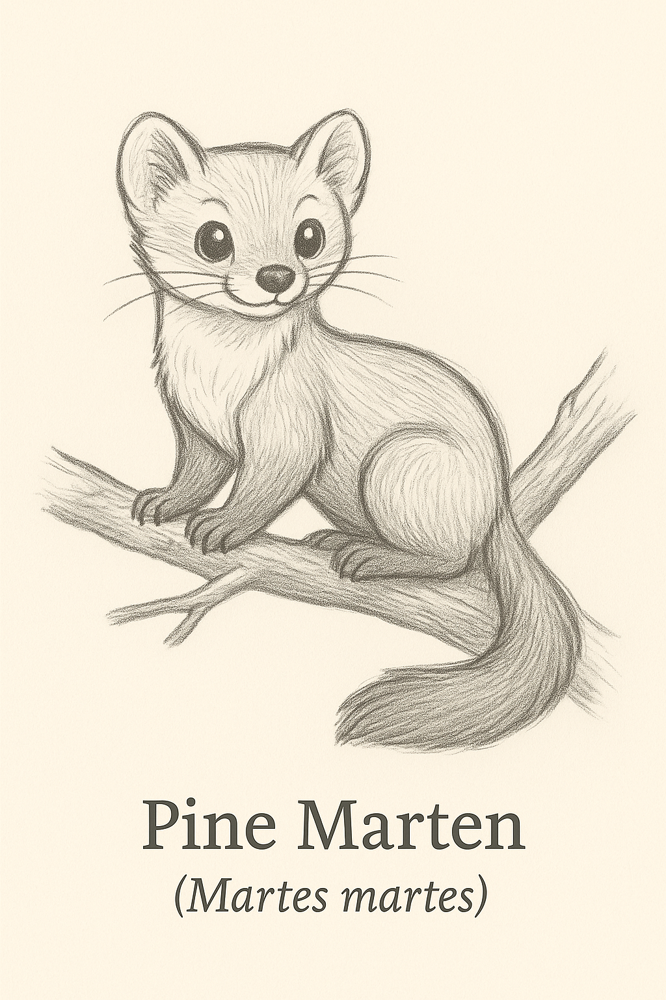
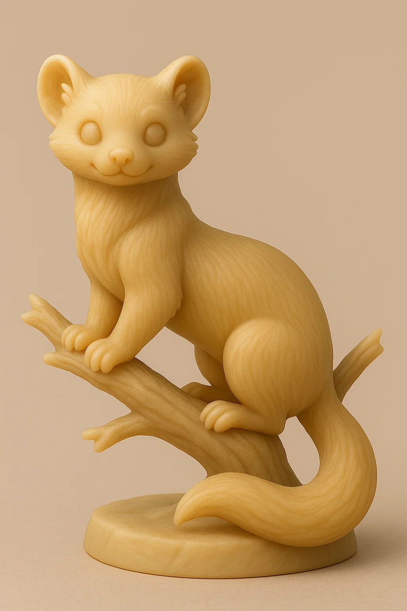

# Marta

## Espécie
**Nome Comum:** Marta (ou Marta-europeia)  
**Nome Científico:** *Martes martes*

### Resumo sobre o animal
A marta é um mustelídeo arborícola de pelagem densa e hábitos noturnos. Vive em florestas temperadas da Europa e é conhecida por sua agilidade entre as árvores. É solitária, silenciosa e possui sentidos aguçados, o que a torna uma excelente caçadora e exploradora de galhos.

---

## Ilustrações

### Referências visuais
> Coletadas na internet, algumas em baixa resolução. Foi montado um painel no PureRef com um subconjunto de cada espécie.

### Rascunho
> Esboço inicial do personagem, feito em estilo tradicional ou digital com traço solto, produzido a partir de várias iterações com sistema de IA Generativa (Chat GPT e Sora), com ajustes manuais, a partir de imagens de referências coletadas na internet.

### Paleta de cores

### Ilustração Digital
> Versão renderizada no Krita com estilo definido da coleção.

EM BREVE!

---

## Miniatura de Resina 3D (Concept IA)
> Concept art para futura modelagem e impressão em resina. Estilo de miniatura de RPG, monocromática, com base.

---

## Ilustração para Livro de Colorir (Lineart)
> Versão lineart do personagem, em preto e branco, com traços suaves e contornos claros.

---

## Ficha Colecionável

### Nome do Personagem
**Marta**

### Espécie
**Marta-europeia** (*Martes martes*)

### Personalidade
Elegante, observadora e independente. A marta não gosta de confusão, mas está sempre no controle da situação. Ama o silêncio e os lugares altos.

### Habilidade Especial
Consegue se mover com incrível leveza mesmo entre galhos finos. Seus pulos são silenciosos, e sua visão noturna é excelente.

### Curiosidade
A mancha clara no peito da marta é sua assinatura visual. Varia de amarelo a creme e ajuda a diferenciá-la de espécies semelhantes.

### Raridade
**Pouco Preocupante**  
_(Categoria da IUCN: Least Concern – distribuição relativamente ampla na Europa, embora vulnerável em algumas regiões devido à perda de habitat)_

---

## Notas Técnicas

- **Expressão canônica:** Atenta e gentil, com corpo levemente curvado como se prestes a saltar.
- **Anatomia:** Corpo alongado, patas curtas e cauda longa e espessa.
- **Olhos:** Pretos ovais com brilho especular.
- **Pelagem:** Castanha escura com mancha clara (amarelada ou creme) no peito.
- **Rascunho referência:** postura arborícola, com orelhas arredondadas bem visíveis e silhueta graciosa.

---

**Referência:**  
Informações científicas adaptadas de: [genuinemustelids.org/family/martens](https://www.genuinemustelids.org/family/martens/)
