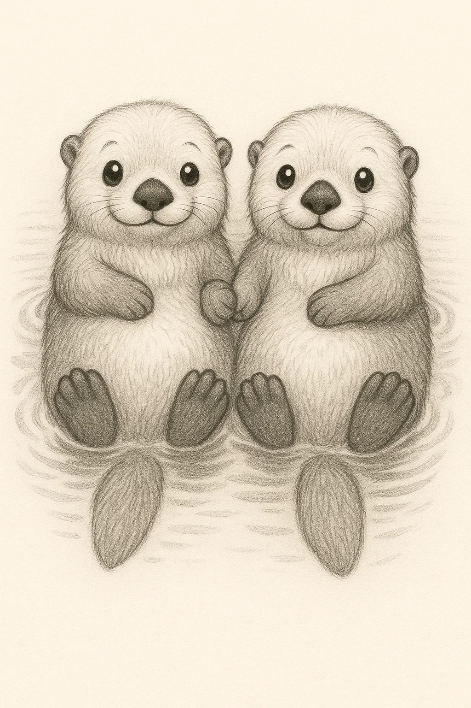
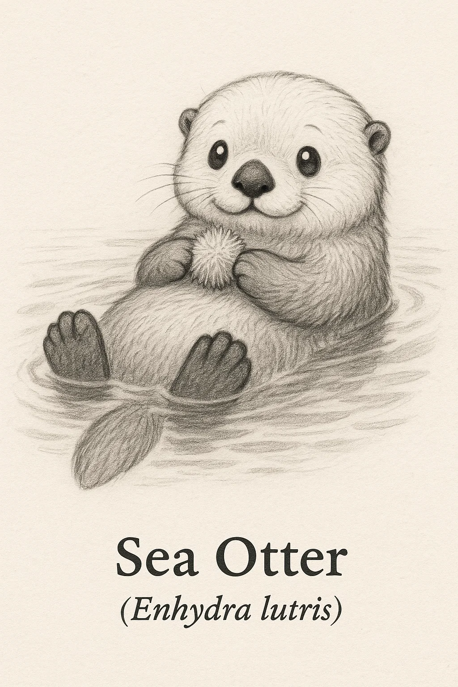
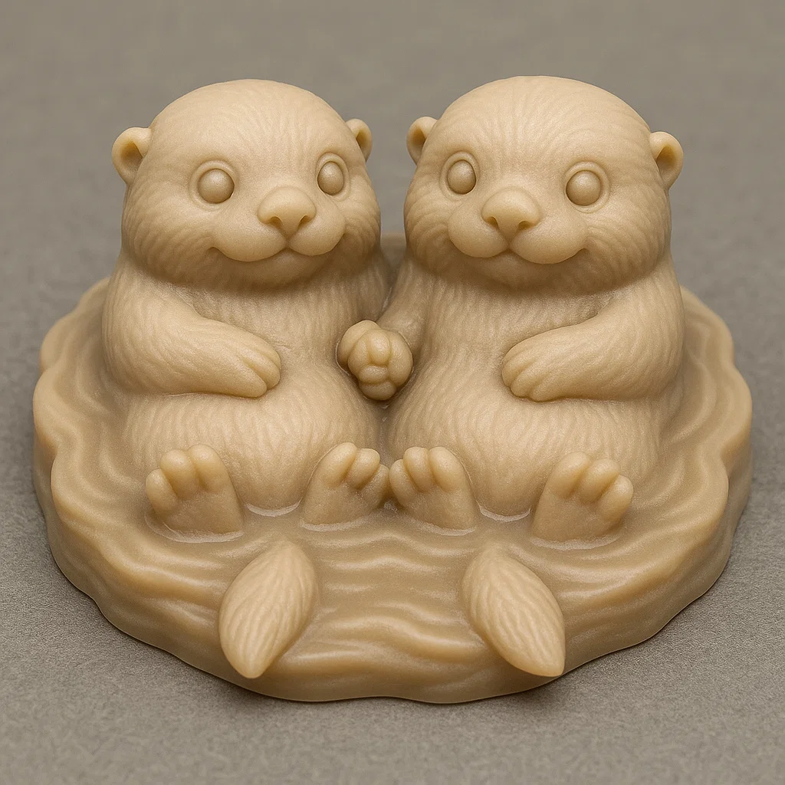
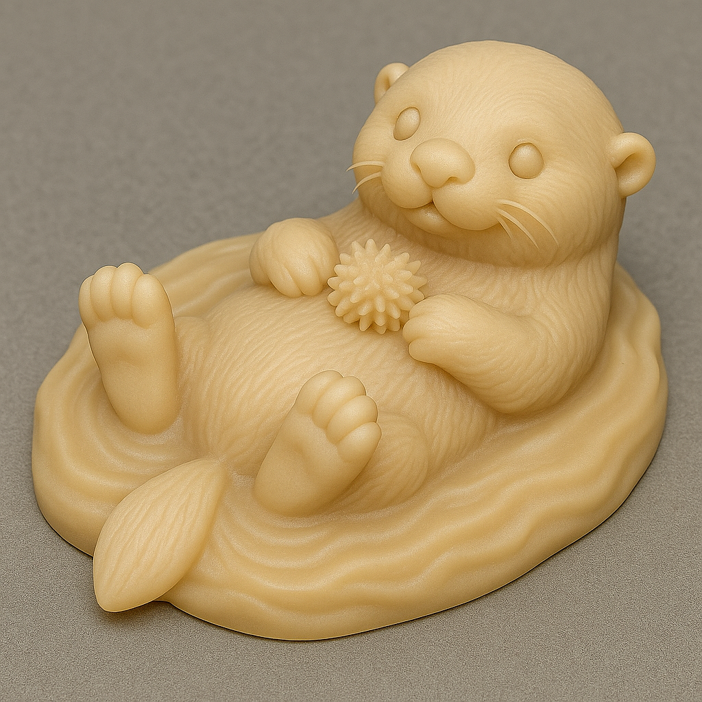

# Lontra-marinha

## Espécie
**Nome Comum:** Lontra-marinha  
**Nome Científico:** *Enhydra lutris*

### Resumo sobre o animal
A lontra-marinha é um mustelídeo exclusivamente marinho, encontrado nas águas frias do Pacífico Norte. Possui a pelagem mais densa do reino animal e é uma das poucas espécies não-primate que utilizam ferramentas. Passa grande parte da vida flutuando de costas, caçando, alimentando-se e cuidando dos filhotes.

---

## Ilustrações

### Referências visuais
> Coletadas na internet, algumas em baixa resolução. Foi montado um painel no PureRef com um subconjunto de cada espécie.

### Rascunho
> Esboço inicial do personagem, feito em estilo tradicional ou digital com traço solto, produzido a partir de várias iterações com sistema de IA Generativa (Chat GPT e Sora), com ajustes manuais, a partir de imagens de referências coletadas na internet.

 

### Paleta de cores

### Ilustração Digital
> Versão renderizada no Krita com estilo definido da coleção.

EM BREVE!

---

## Miniatura de Resina 3D (Concept IA)
> Concept art para futura modelagem e impressão em resina. Estilo de miniatura de RPG, monocromática, com base.

---

## Ilustração para Livro de Colorir (Lineart)
> Versão lineart do personagem, em preto e branco, com traços suaves e contornos claros.

---

## Ficha Colecionável

### Nome do Personagem
**Lontra-marinha**

### Espécie
**Lontra-marinha** (*Enhydra lutris*)

### Personalidade
Brincalhona, engenhosa e sociável. Tem sempre uma pedrinha ou concha por perto e está constantemente arquitetando maneiras de abrir snacks do mar.

### Habilidade Especial
Utiliza pedras como ferramentas para abrir moluscos. Pode guardar pequenos objetos em “bolsos” sob os braços — inclusive a pedrinha favorita!

### Curiosidade
As lontras-marinhas formam “jangadas” flutuantes de até 100 indivíduos, e frequentemente dão as mãos para não se separarem na correnteza.

### Raridade
**Em Perigo**  
_(Categoria da IUCN: Endangered – severamente afetada no passado pela caça, hoje ameaçada por poluição e impactos ambientais)_

---

## Notas Técnicas

- **Expressão canônica:** Alegre e relaxada, geralmente em posição de flutuação com as patas para cima.
- **Anatomia:** Corpo compacto, cauda achatada, focinho arredondado e patas posteriores largas com membranas.
- **Olhos:** Pretos ovais com brilho especular.
- **Pelagem:** Marrom densa, às vezes com rosto mais claro (especialmente em adultos).
- **Rascunho referência:** posição dorsal flutuando, com patinhas sobre o peito e expressão relaxada.

---

**Referência:**  
Informações científicas adaptadas de: [genuinemustelids.org/family/otters/](https://www.genuinemustelids.org/family/otters/)