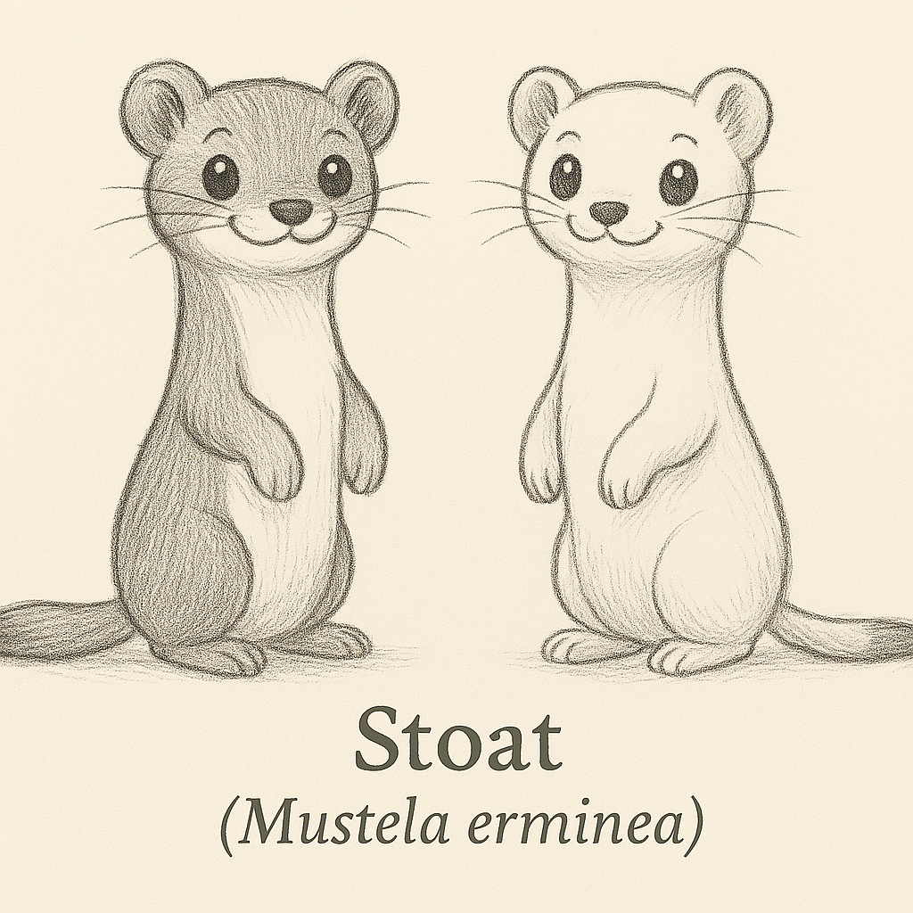
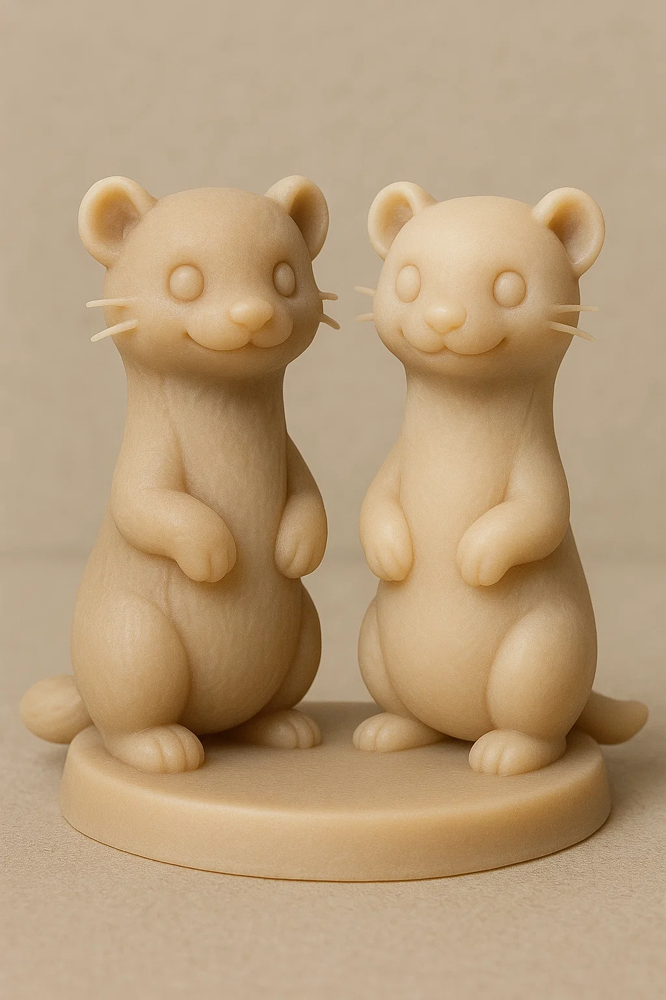
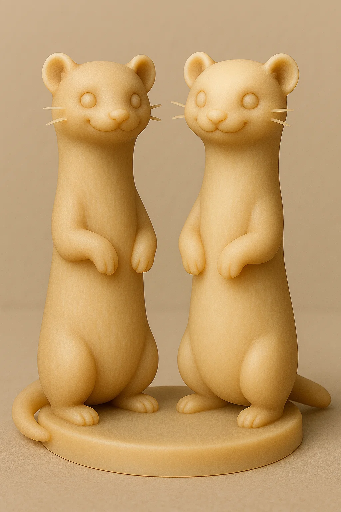
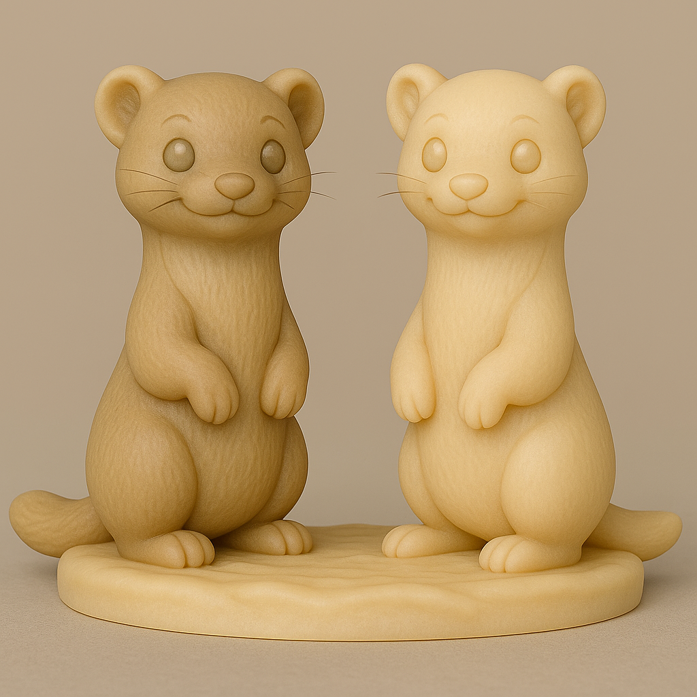
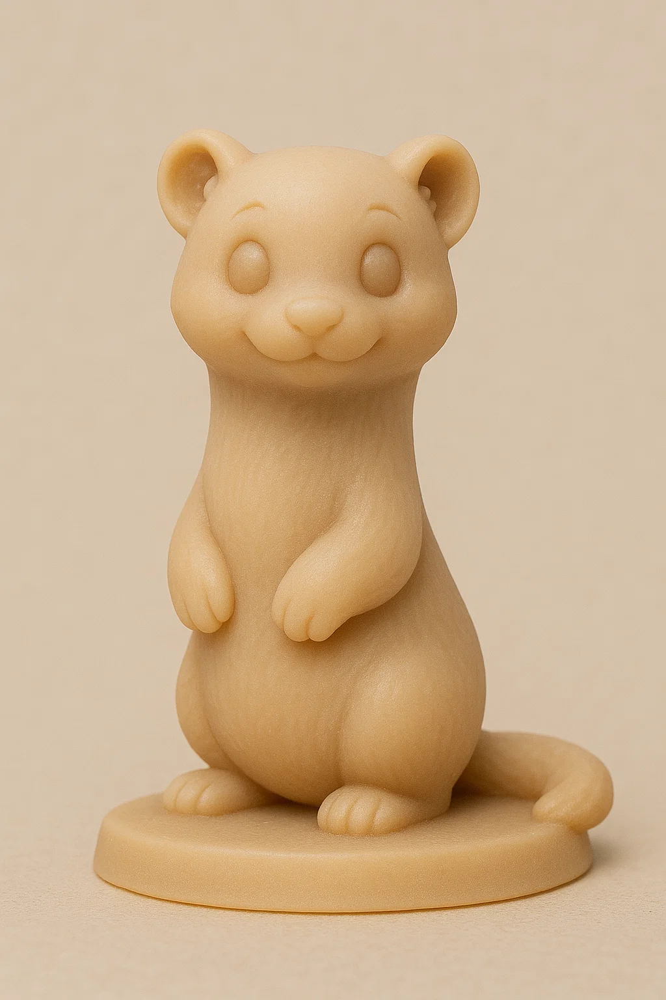
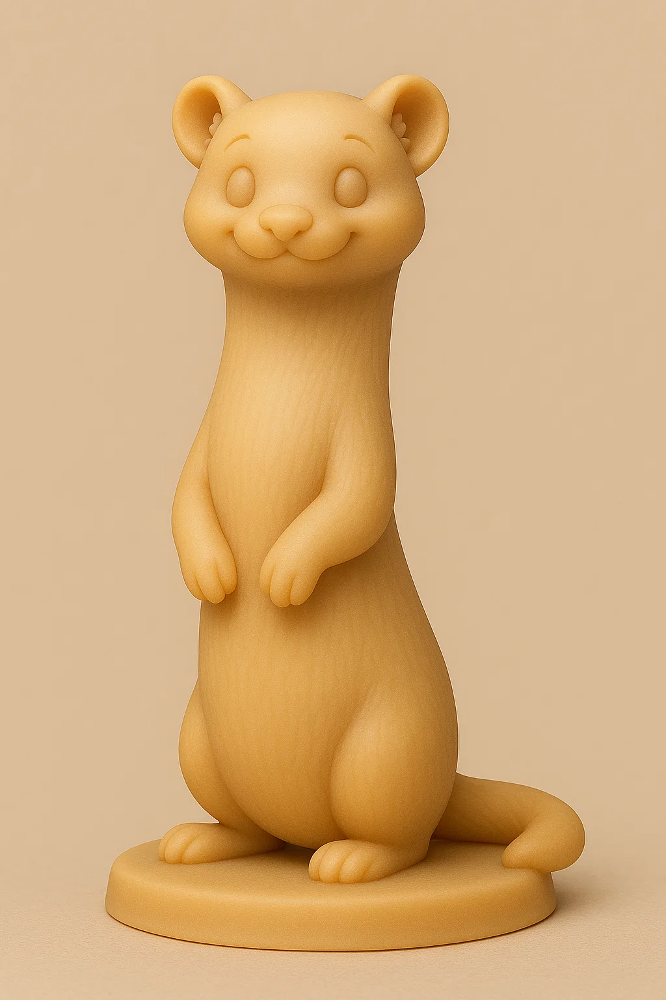

# Arminho

## Espécie
**Nome Comum:** Arminho (ou Stoat)  
**Nome Científico:** *Mustela erminea*

### Resumo sobre o animal
O arminho é uma pequena doninha ágil e carnívora, conhecida por sua impressionante troca de pelagem conforme a estação: marrom no verão e completamente branco no inverno (com exceção da ponta da cauda preta). Habita regiões frias do hemisfério norte e é um predador feroz, apesar do tamanho diminuto.

---

## Ilustrações

### Referências visuais
> Coletadas na internet, algumas em baixa resolução. Foi montado um painel no PureRef com um subconjunto de cada espécie.

### Rascunho
> Esboço inicial do personagem, feito em estilo tradicional ou digital com traço solto, produzido a partir de várias iterações com sistema de IA Generativa (Chat GPT e Sora), com ajustes manuais, a partir de imagens de referências coletadas na internet.

### Paleta de cores

### Ilustração Digital
> Versão renderizada no Krita com estilo definido da coleção.

EM BREVE!

---

## Miniatura de Resina 3D (Concept IA)
> Concept art para futura modelagem e impressão em resina. Estilo de miniatura de RPG, monocromática, com base.

---

## Ilustração para Livro de Colorir (Lineart)
> Versão lineart do personagem, em preto e branco, com traços suaves e contornos claros.

---

## Ficha Colecionável

### Nome do Personagem
**Arminho**

### Espécie
**Arminho** (*Mustela erminea*)

### Personalidade
Ágil, atento e estrategista. Não se engane pelo tamanho: o arminho é rápido, calculista e adora surpreender com saltos repentinos.

### Habilidade Especial
Troca sua pelagem conforme a estação — praticamente um mestre do disfarce. No inverno, é difícil de encontrar; no verão, é difícil de pegar!

### Curiosidade
A ponta da cauda preta do arminho permanece assim mesmo durante o inverno, quando todo o restante do corpo fica branco. Acredita-se que isso ajude a desviar o ataque de predadores para longe da cabeça.

### Raridade
**Pouco Preocupante**  
_(Categoria da IUCN: Least Concern – amplamente distribuído em áreas frias do hemisfério norte)_

---

## Notas Técnicas

- **Expressão canônica:** Enérgica e alerta, com corpo arqueado em posição de pulo ou espreita.
- **Anatomia:** Corpo longo e esguio, cauda média com ponta preta, orelhas pequenas.
- **Olhos:** Pretos ovais com brilho especular.
- **Pelagem:** Marrom clara no verão, branca no inverno (exceto cauda).
- **Rascunho referência:** versões de pelagem de verão e inverno, com atenção à silhueta dinâmica.

---

**Referência:**  
Informações científicas adaptadas de: [genuinemustelids.org/family/weasels/old-world-weasels](https://www.genuinemustelids.org/family/weasels/old-world-weasels/)
