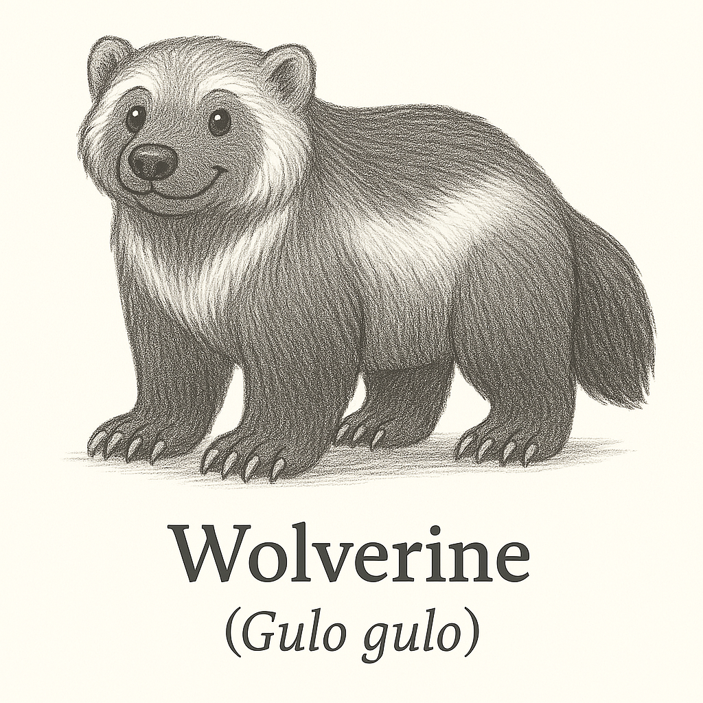
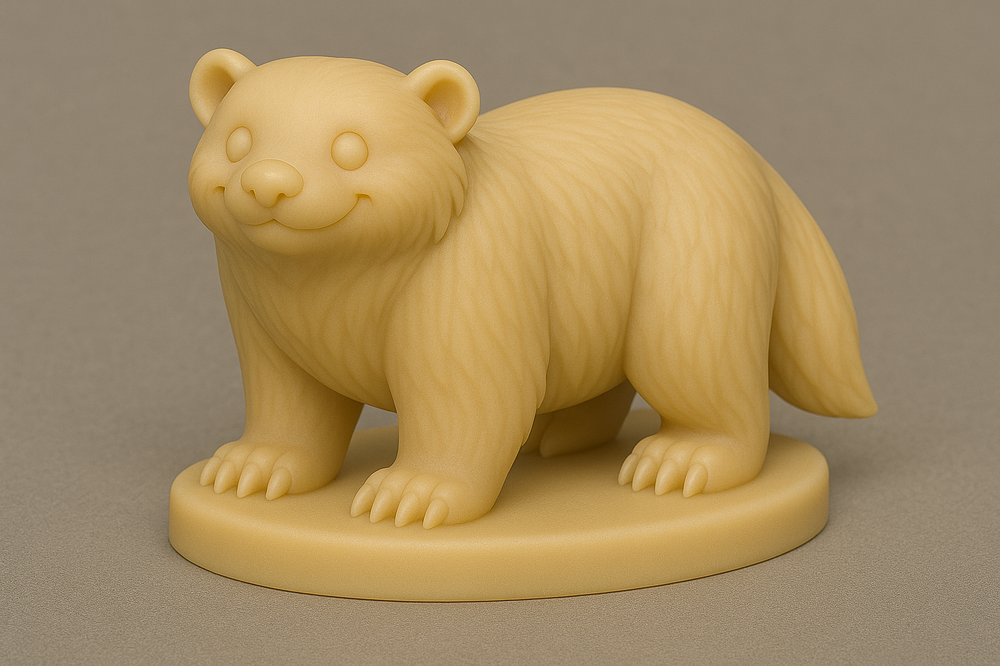

# Wolverine

## Espécie
**Nome Comum:** Wolverine  
**Nome Científico:** *Gulo gulo*

### Resumo sobre o animal
O wolverine, também conhecido como glutão, é o maior dos mustelídeos terrestres. Apesar de sua aparência semelhante à de um pequeno urso, é parente de doninhas e texugos. Possui força surpreendente para seu tamanho, além de grande resistência e habilidade em ambientes hostis. É solitário e territorial, habitando regiões frias e remotas do hemisfério norte.

---

## Ilustrações

### Referências visuais
> Coletadas na internet, algumas em baixa resolução. Foi montado um painel no PureRef com um subconjunto de cada espécie.

### Rascunho
> Esboço inicial do personagem, feito em estilo tradicional ou digital com traço solto, produzido a partir de várias iterações com sistema de IA Generativa (Chat GPT e Sora), com ajustes manuais, a partir de imagens de referências coletadas na internet.

### Paleta de cores

### Ilustração Digital
> Versão renderizada no Krita com estilo definido da coleção.

EM BREVE!

---

## Miniatura de Resina 3D (Concept IA)
> Concept art para futura modelagem e impressão em resina. Estilo de miniatura de RPG, monocromática, com base.

---

## Ilustração para Livro de Colorir (Lineart)
> Versão lineart do personagem, em preto e branco, com traços suaves e contornos claros.

---

## Ficha Colecionável

### Nome do Personagem
**Wolverine**

### Espécie
**Wolverine** (*Gulo gulo*)

### Personalidade
Solene, reservado e incrivelmente determinado. Um andarilho silencioso dos bosques gelados, observando tudo antes de agir.

### Habilidade Especial
Consegue abrir qualquer pote de geleia, mesmo congelado. Seu faro é lendário, e ele pode sentir um lanche escondido a quilômetros.

### Curiosidade
Apesar de solitário, costuma guardar pequenos mimos para seus amigos — como pedras bonitas ou folhas raras.

### Raridade
**Quase Ameaçado**  
_(Categoria da IUCN: Near Threatened — espécies que podem se tornar ameaçadas em breve)_

---

## Notas Técnicas

- **Expressão canônica:** Séria, focada e um pouco carrancuda.
- **Anatomia:** Corpo robusto, pernas curtas, pelagem espessa e cauda volumosa.
- **Olhos:** Pequenos, pretos e ovalados.
- **Pelagem:** Tons escuros com faixa mais clara lateralmente.
- **Rascunho referência:** Garras visíveis e postura sólida, com destaque para força e resiliência.

---

Fonte: [Genuine Mustelids – Wolverine](https://www.genuinemustelids.org/family/wolverine/)
